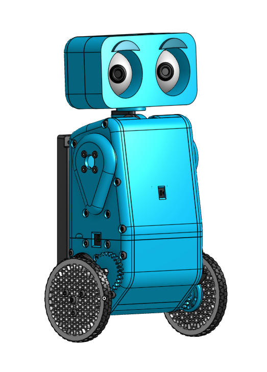

## Weeble

Weeble is a 2 wheeled balancing robot with a lot of personality!
It is a fun project I started after the First Tech Challenge season of 2024.
It features 2 wheels, 2 arms, and a head with moving eyes all compacted into fully 3d printed body.
It balances using a cascading PID loop and has fun features like head and eye tracking with moving eyebrows!

More coming soon!