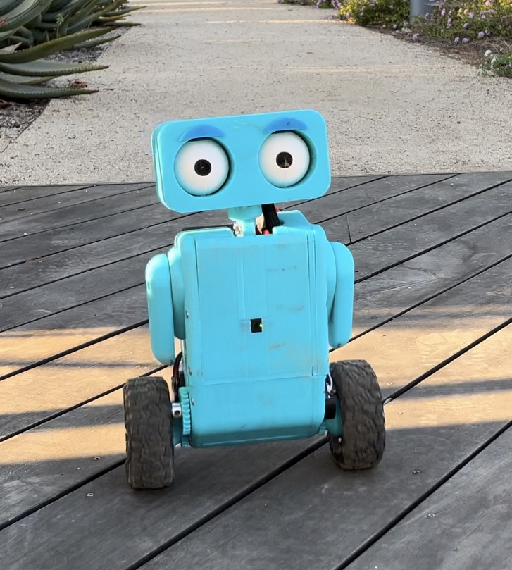
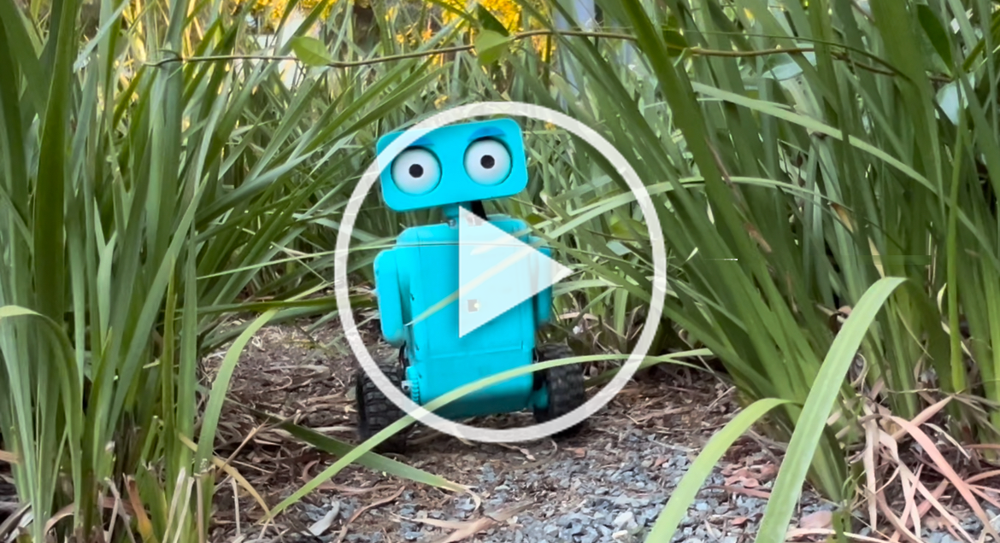
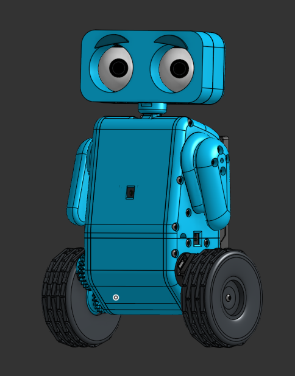
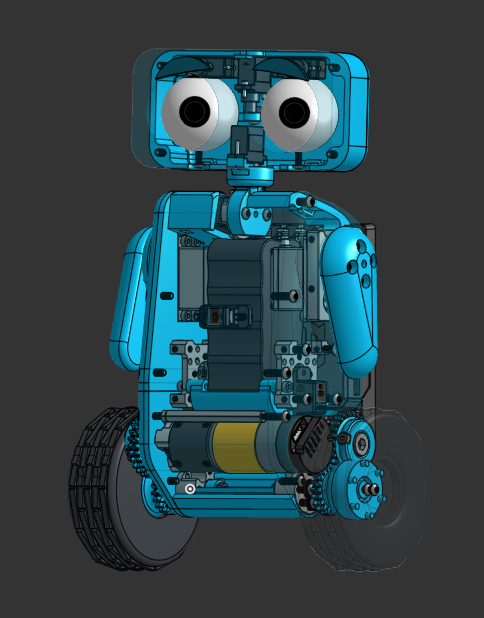
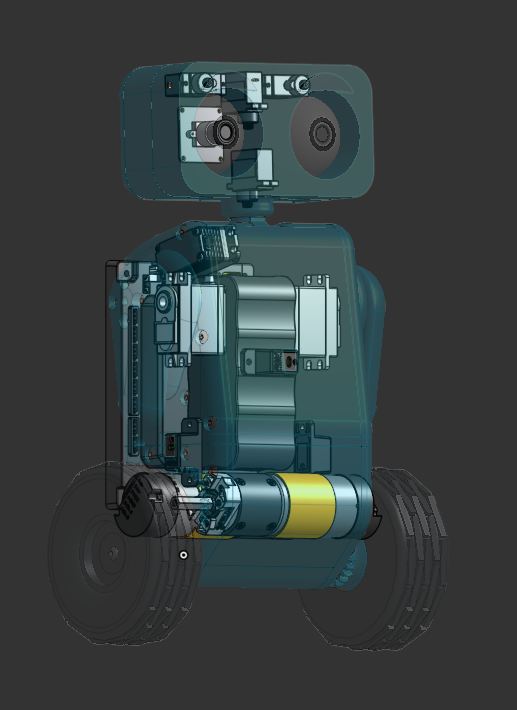

# Weeble

Weeble is a cute 2 wheeled self-balancing robot made with FTC parts and a fully 3D printed body. Weeble uses a Linear Quadratic
Regulator (LQR) controller to balance and drive around!

  
  

It took a lot of work to `fit the many features` of Weeble into such a `compact fully 3d printed cute` robot let alone
get him to `balance and drive so stable` `with the slow 20ms loop times of the Control Hub` and being `7.5 pounds`! Hope you like him!

- Fully `3d Printed` Body
- `Linear Quadratic Regulator (LQR) controller` to balance and drive around the `7.5 pound` Weeble!
- A `1080P Camera` embedded in the right eye, used for `computer vision (openCV)`
- `Object detection and tracking` with `embedded camera in right eye`
- A `head that can move` up, down, left and right super quickly
- `2 massive adorable eyes`, that both `move side to side`
- `Moveable eyebrows` to express `complex emotions`
- `2 cute arms` powered by servos
- `2 epic 100mm Wheels` powered by `312 rpm motors`, `high torque` because Weeble is heavy!
- `3 2M TOF distance sensors` for `autonomous driving and obstacle detection`
- `Efficient LQR controller` and `12V battery` means `long 30+ min battery life`.

## Table of Contents

- [Robot Reveal Video](#robot-reveal-video)
- [Onshape CAD Assembly](#onshape-cad-assembly)
- [How Does Weeble Balance?](#how-does-weeble-balance)
    - [Linear Quadratic Regulator (LQR) Controller](#linear-quadratic-regulator-lqr-controller)
    - [About LQR Controller](#about-lqr-controller)
    - [State-Space Model](#state-space-model)
    - [Optimal Control Law](#optimal-control-law)
- [What is Weeble Made Of?](#what-is-weeble-made-of)
- [How Does Weeble Work?](#how-does-weeble-work)
- [Why Was Weeble Made?](#why-was-weeble-made)
  
## Robot Reveal Video

Watch the video below to see Weeble in action! The video shows the progressions of Weeble from the first version to the
current version. Also, the video is better with sound!

### Click above or use the link below to watch the video!

[Weeble - Robot Reveal (YouTube)](https://www.youtube.com/watch?v=vaklsPUqb7Q)

## Onshape CAD Assembly

Follow the link below to view the full CAD assembly of Weeble. The assembly includes every part of Weeble, from the big
3d printed parts
to the smallest screws!

### [Onshape Assembly](https://cad.onshape.com/documents/580f78b3fd6e84e547fe38d2/w/b6d75d737f737433c694a54b/e/f82997b12f5279d180b2472a?renderMode=0&uiState=66ce9b099fbb4060b414570f)

  
  
  

## How Does Weeble Balance?

[//]: # ()

### Linear Quadratic Regulator (LQR) Controller

Weeble balances using a `Linear Quadratic Regulator (LQR) Controller`. The previous versions of Weeble used a `PID
controller`, but the `LQR controller` is much `more efficient and stable`. Also, with the `slow 20ms loop speed of the REV
Control Hub`, the `PID was unable to be effective enough`. Below are the key java classes that handle keeping Weeble
balanced (github links):

- [**LQRController.java
  **](https://github.com/BrandonKirbyson/Weeble/blob/main/TeamCode/src/main/java/org/firstinspires/ftc/teamcode/util/drive/LQRController.java) -
  The LQR controller class. It calculates the optimal gains and calculates the optimal control input for the motors.

- [**GyroDrive.java
  **](https://github.com/BrandonKirbyson/Weeble/blob/main/TeamCode/src/main/java/org/firstinspires/ftc/teamcode/util/drive/GyroDrive.java) -
  The class that handles the balancing of Weeble. It uses the LQR controller class and the states of Weeble.

### About LQR Controller

The `LQR controller` uses the `state-space model` of the robot to
`calculate the optimal gains` to keep Weeble balanced. The state-space model is a mathematical model that represents
the behavior of a physical system as the set of input, output, and state variables. The gains are used with the state of
the robot (
angle, angular velocity, position, and velocity) `to keep the robot balanced and driving`. Future
improvements will be made to make the `LQR controller PID-assisted to improve velocity control`.

Below are the two most important components of the LQR controller, there are many more equations and components that
make up
the
LQR controller but these are the most important and easiest to understand.

### State-Space Model

The dynamics of the system are modeled as a set of linear differential equations:

[//]: # ($$)

[//]: # (\dot{x} = A x + B u)

[//]: # ($$)

`ẋ = Ax + Bu`

- `x` is the state vector (angle, angular velocity, position, velocity)
- `u` is the control input vector (motor power)
- `A` is the state matrix (how state evolves over time)
- `B` is the input matrix (how control input affects state)

### Optimal Control Law

The control input `u` is computed using the feedback law:

[//]: # ($$)

[//]: # (u = -K x)

[//]: # ($$)

`u = -Kx`

- `K` is the feedback gain matrix (computed using LQR)
- `x` is the state vector (angle, angular velocity, position, velocity)
- `u` is the control input vector (motor power to keep the robot balanced)

## What is Weeble Made Of?

- **Fully** 3D printed body
- `2x` 100mm rubber wheels with 3D printed hubs
- `2x` 312 RPM GoBilda DC motors with encoders (Wheels)
- `1x` REV Control Hub (Brain)
- `2x` REV Servos (Arms)
- `1x` Axon Mini+ Servo (Neck)
- `4x` SG90S Servos (Head, Eyes, Eyebrows)
- `3x` REV 2M Distance Sensors (Front, Left, Right)
- `1x` Innomaker Arducam (Embedded in Right Eye, OpenCV)
- `1x` 12V Battery (Power)

All `3 versions` of Weeble were `fully designed in OnShape` and 3D printed parts were made with a
`Prusa Mini+ 3D printer`.

[Onshape CAD Assembly](https://cad.onshape.com/documents/580f78b3fd6e84e547fe38d2/w/b6d75d737f737433c694a54b/e/f82997b12f5279d180b2472a?renderMode=0&uiState=66ce9b099fbb4060b414570f)

## How Does Weeble Work?

Weeble is programmed in `Java` using the `FTC SDK` as he uses a `leftover REV Control Hub from the 2024 FTC season`. He
also
uses `OpenCV to track objects and faces`. The robot is
`controlled wireless with a Logitech Gamepad over a WiFi connection`
to the REV Control Hub.

## Why Was Weeble Made?

I made Weeble as a challenge to myself to see if I could make a balancing robot. I also wanted to make a robot that was
fun with a personality, hence the moving head, eyes, and eyebrows. Now that Weeble is built, I plan to use him as a
platform to
work on computer vision projects, point cloud mapping, and autonomous driving.
