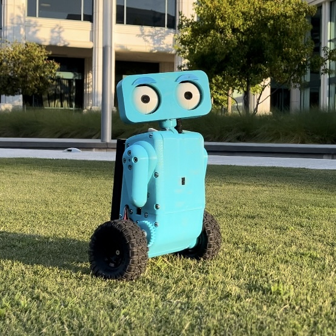

# Weeble

Weeble is a 2 wheeled balancing robot with a lot of personality!
He features 2 wheels, 2 arms, and a moving head, eyes, and eyebrows all compacted into fully 3d printed body.
To balance, he uses a LQR Controller and also has fun features like head and eye tracking!

[Robot Reveal Video](https://www.youtube.com/watch?v=vaklsPUqb7Q)

[Onshape CAD Assembly](https://cad.onshape.com/documents/580f78b3fd6e84e547fe38d2/w/b6d75d737f737433c694a54b/e/f82997b12f5279d180b2472a?renderMode=0&uiState=66ce9b099fbb4060b414570f)

## How Does Weeble Balance?

- Linear Quadratic Regulator (LQR) Controller

Weeble balances using a Linear Quadratic Regulator (LQR) Controller. The previous versions of Weeble used a PID
controller, but the LQR controller is much more efficient and stable. Also, with the slower loop speed of the REV
Control Hub, the PID was unable to be effective enough. The LQR controller uses the state-space model of the robot to
calculate the optimal gains to keep the model balanced. The state-space model is a mathematical model that represents
the behavior of a physical system as the set of input, output, and state variables. The gains are used with the state of
the robot (
angle, angular velocity, position, and velocity) to keep the robot balanced and driving. Future
improvements will be made to make the LQR controller PID-assisted to improve velocity control.

## What is Weeble Made Of?

- Fully 3D printed body
- 2x 100mm rubber wheels with 3D printed hubs
- 2x 312 RPM GoBilda DC motors with encoders (Wheels)
- REV Control Hub (Brain)
- 2x REV Servos (Arms)
- 1x Axon Mini+ Servo (Neck)
- 4x SG90S Servos (Head, Eyes, Eyebrows)
- 3x REV 2M Distance Sensors (Front, Left, Right)
- 1x Innomaker Arducam (Embedded in Right Eye, OpenCV)
- 1x 12V Battery (Power)

All 3 versions of Weeble were fully designed in OnShape and 3D printed parts were made with a Prusa Mini+ 3D printer.

## How Does Weeble Work?

Weeble is programmed in Java using the FTC SDK as he uses a leftover REV Control Hub from the 2024 FTC season. He also
uses OpenCV to track objects and faces. The robot is controlled wireless with a Logitech Gamepad over a WiFi connection
to the REV Control Hub.

## Why Was Weeble Made?

I made Weeble as a challenge to myself to see if I could make a balancing robot. I also wanted to make a robot that was
fun with a personality, hence the moving head, eyes, and eyebrows. Now that Weeble is built, I plan to use him as a
platform to
work on computer vision projects, point cloud mapping, and autonomous driving.
