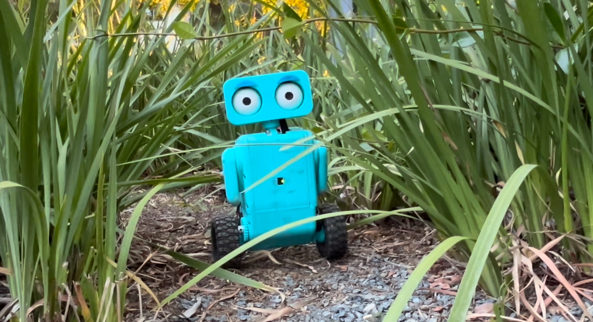

## Weeble

Weeble is a 2 wheeled balancing robot with a lot of personality!
It is a fun project I started after the First Tech Challenge season of 2024.
It features 2 wheels, 2 arms, and a moving head, eyes, and eyebrows all compacted into fully 3d printed body.
It balances using a LQR Controller and has fun features like head and eye tracking!

## How Does Weeble Balance?

- Linear Quadratic Regulator (LQR) Controller

Weeble balances using a Linear Quadratic Regulator (LQR) Controller. The previous versions of Weeble used a PID
controller, but the LQR controller is much more efficient and stable. Also, with the slower loop speed of the REV
Control Hub the PID was unable to be as effective as it could be due to the high latency. The LQR controller uses the
state of the robot (
angle, angular velocity, and position) to calculate the optimal control input to keep the robot balanced. Future
improvements will be made to make the LQR controller assisted with a PID controller for better velocity control.

## What is Weeble Made Of?

- Fully 3D printed body
- 2x 100mm rubber wheels with 3D printed hubs
- 2x 312 RPM GoBilda DC motors with encoders (Wheels)
- REV Control Hub (Brain)
- 2x REV Servos (Arms)
- 1x Axon Max+ Servo (Neck)
- 4x SG90S Servos (Head, Eyes, Eyebrows)
- 3x REV 2M Distance Sensors (Front, Left, Right)
- 1x Innomaker Arducam (Embedded in Right Eye, OpenCV)
- 1x 12V Battery (Power)
-

All 3 versions of Weeble were fully designed in OnShape and 3D printed parts were made with a Prusa Mini+ 3D printer.

## How Does Weeble Work?

Weeble is programmed in Java using the FTC SDK as it uses a leftover REV Control Hub from the 2024 FTC season. It also
uses OpenCV to track objects and faces. The robot is controlled wireless with a Logitech Gamepad over a WiFi connection
to the REV Control Hub. 